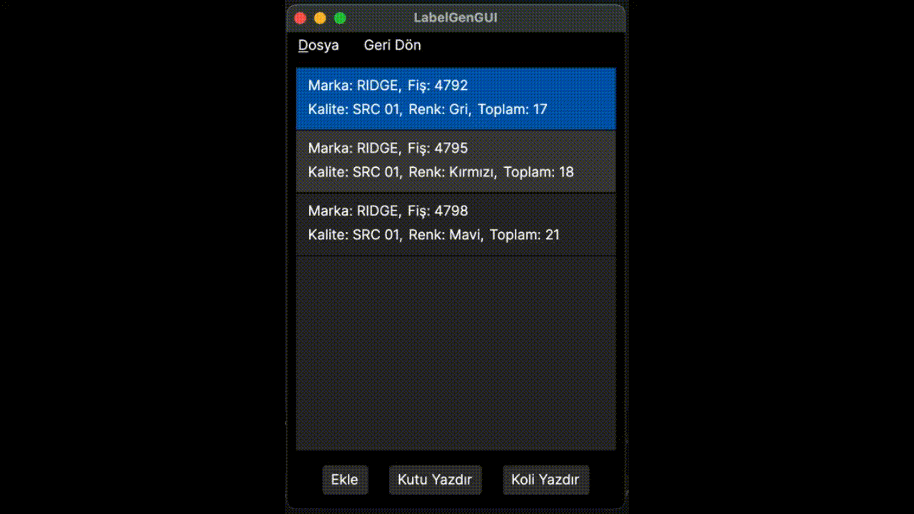

# 👞 Shoe Label Generator & Print Automation


> **A cross-platform industrial printing solution developed to automate the workflow for a local shoe manufacturer.**

## 📖 Overview
This application generates standardized product labels from user input and supports sending them directly to Zebra thermal printers via the **IPP (Internet Printing Protocol)**.

<p align="center">
  
</p>

> *Demo running natively on macOS (Avalonia UI), showing the input, batch selection and printing interface.*

## ✨ Key Features
* **Cross-Platform Architecture:** Runs natively on Windows, macOS, Linux, and Android (experimental) using a single codebase.
* **Custom ZPL Engine:** Features a **custom-built image-to-ZPL converter**, eliminating dependencies on paid/proprietary drivers.
* **Network Printing:** Implements raw **IPP (Internet Printing Protocol)** for driverless communication with Zebra printers over local networks.
* **List Management:** capable of batch-processing hundreds of labels in a single print job.
* **Localized UI:** Interface custom-built in Turkish for local workers.

## 🛠️ Technical Deep Dive
* **NativeAOT Compilation:** Optimized using .NET Native Ahead-of-Time (AOT) compilation. This reduces startup time significantly and eliminates the need for the .NET Runtime to be installed.
* **Image Processing:** Utilizes **ImageSharp** for label rendering before conversion.
* **Protocol Implementation:** Direct communication handling for printer job submission.

## 🚀 Getting Started

### Prerequisites
* A Zebra-compatible printer (ZPL support) connected to the local network.
* .NET 9.0 SDK, for building from source.

### Usage
1.  Clone the repository:
    ```bash
    git clone https://github.com/entaromia/ShoeLabelGenerator.git
    ```
2.  Build and run the project:
    ```bash
    dotnet run --project LabelGenGUI.Desktop
    ```
3.  Go to `Yazdır` and input your printer's local IP address & port number (e.g., `192.168.1.105:631`).

## 🔮 Future Roadmap
* [ ] USB support for direct printing.
* [ ] Database integration for order history.

## 📄 License
Mozilla Public License 2.0
